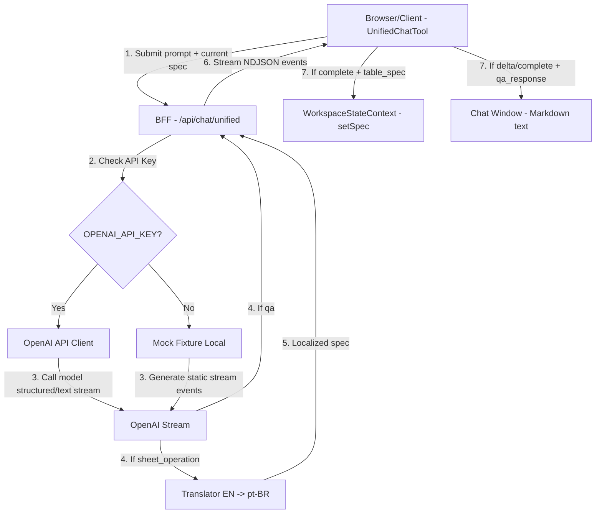

# Phase 20: Protocolo de Mutação Chat→Grade & Q&A - Research

**Researched:** 2026-06-14
**Domain:** Next.js API Routes NDJSON streaming + OpenAI Structured Outputs + `@formulajs/formulajs` + Brazilian Portuguese formula localization
**Confidence:** HIGH

<user_constraints>
## User Constraints (from CONTEXT.md)

### Locked Decisions
- **D-01: Planilha Completa no Contexto:** O cliente enviará o estado completo atual da planilha (`spec` contendo título, colunas, tipos e todas as linhas) a cada chamada da API do chat. Como o limite máximo de linhas é 200 (garantido pela ingestão na Phase 19), enviar toda a planilha como JSON ou Markdown no prompt garante precisão total nas edições/análises da IA.
- **D-02: Zero-Click com Desfazer:** Quando o intent for `sheet_operation` e o stream terminar, as alterações propostas pela IA (um novo `TableSpecPayload` completo) serão aplicadas imediatamente à grade viva (Zero-click) via `setSpec(payload)`. Como o `WorkspaceStateProvider` já possui histórico de undo/redo integrado, a chamada de `setSpec` adiciona o estado anterior ao histórico, permitindo que o usuário reverta facilmente a mutação pressionando Ctrl+Z ou os controles visuais.
- **D-03: Localização Bidirecional / Geração em Inglês:** O LLM será instruído a gerar fórmulas sempre no padrão US/inglês (ex.: separador `,` e funções como `SUM`, `IF`, `VLOOKUP`). O BFF/frontend traduzirá essas fórmulas dinamicamente para o padrão brasileiro (pt-BR com `;` e funções como `SOMA`, `SE`, `PROCV`) antes de atualizá-las na planilha viva. Isso aumenta drasticamente a taxa de sucesso e a confiabilidade de geração da IA.
- **D-04: Markdown Puro em Streaming:** Respostas para perguntas que não alteram a planilha (intent `qa`) serão renderizadas puramente como texto formatado em Markdown com streaming direto no chat. Não haverá cards ou elementos de métrica destacados adicionais nesta fase, priorizando velocidade e simplicidade.
- **D-05: Mock Local Sem API Key:** Na ausência de `OPENAI_API_KEY` no ambiente, o endpoint `/api/chat/unified` responderá de forma determinística por meio de um provedor de fixture local que simula o streaming de NDJSON com os eventos apropriados (`intent_detected`, `delta`, `complete`) correspondentes à intenção do usuário, mantendo a localização de fórmulas intacta para testes/desenvolvimento sem custos.

### the agent's Discretion
- As instruções detalhadas e prompts do sistema (incluindo diretivas de formato JSON para `table_spec` e exemplos few-shot) ficam a critério do planejador/implementador.
- A implementação exata da função de inversão de mapeamento de fórmulas (inglês → português) a partir das chaves existentes em `formula-locale.ts`.
- Os payloads de mock específicos a retornar em ambiente de teste/dev sem `OPENAI_API_KEY` com base no prompt enviado.

### Deferred Ideas (OUT OF SCOPE)
- **Metric Cards no Chat:** Cards visuais destacados para respostas analíticas em Q&A.
- **Divisória lateral arrastável:** Redimensionamento flexível da grade vs. chat (mantido com proporção fixa de 70/30 da Phase 16).
- **Persistência da planilha + conversa:** Escopo da Phase 21.
</user_constraints>

<architectural_responsibility_map>
## Architectural Responsibility Map

| Capability | Primary Tier | Secondary Tier | Rationale |
|------------|-------------|----------------|-----------|
| Envio do Contexto da Planilha | Browser/Client | Frontend Server | O cliente lê o estado atual do `WorkspaceStateContext` e o anexa ao corpo do POST. |
| Roteamento e Classificação de Intent | API/Backend (LLM) | — | O BFF/API `/api/chat/unified` classifica o pedido usando o `classifyIntent` (OpenAI ou Fixture). |
| Geração de Resposta da IA (Structured/Q&A) | API/Backend (LLM) | — | O LLM (ou mock local) gera o NDJSON stream. Para mutações, gera um `TableSpecPayload` completo usando inglês; para Q&A, gera o texto markdown. |
| Tradução de Fórmulas (EN -> pt-BR) | API/Backend (Next.js) | — | O BFF traduz as fórmulas geradas pela IA do padrão americano para o padrão brasileiro antes de enviá-las ao cliente. |
| Aplicação da Mutação na Planilha | Browser/Client | Frontend Server | O cliente recebe o payload `table_spec` completo e chama `setSpec(payload)` para atualizar a planilha viva com undo/redo. |
| Streaming e Renderização | Browser/Client | — | O cliente processa a resposta do endpoint com streaming e renderiza deltas textuais ou o payload completo no final. |
</architectural_responsibility_map>

<research_summary>
## Summary

Esta pesquisa mapeia a integração entre o chat unificado e a planilha viva no Tabelin.IA. Para garantir o tempo de resposta rápido exigido pelo PRD (< 2.5 segundos para streaming), a arquitetura utiliza a classificação binária de intenção rápida do OpenAI Responses API seguido pela geração estruturada ou streaming de texto.

A aplicação direta de alterações à planilha viva (Zero-click) se beneficia do sistema de histórico baseado em Reducer já existente no `WorkspaceStateProvider`. O cliente simplesmente passa o estado atual da tabela (`spec`) no prompt e, caso o retorno do LLM seja um novo `TableSpecPayload` (mutação), o cliente chama `context.setSpec()`, o qual atualiza a grade e empilha o estado anterior no array de undo.

O maior desafio técnico reside na localização das fórmulas geradas. O LLM tem grande probabilidade de cometer erros ao gerar funções específicas brasileiras com separadores de ponto-e-vírgula (ex. `SOMASE` com `;`). A melhor prática estabelecida é instruir o LLM a gerar fórmulas no padrão americano padrão (EN e `,`), e realizar uma pós-tradução regex no BFF para convertê-las em pt-BR (separador `;` e funções mapeadas em `PT_BR_TO_EN`) antes do envio ao cliente.

**Primary recommendation:** Instruir o LLM a gerar no padrão americano, aplicar a tradução EN -> pt-BR no servidor, e no cliente escutar o stream chamando `setSpec` somente no evento `complete` com `table_spec`.
</research_summary>

<standard_stack>
## Standard Stack

### Core
| Library | Version | Purpose | Why Standard |
|---------|---------|---------|--------------|
| openai | 6.39.0 | LLM integration, vision and streaming | SDK oficial suportando Structured Outputs e assistente. |
| next | 16.2.6 | Web app frame and API routes | Next.js API Routes para streaming NDJSON. |
| @formulajs/formulajs | 4.6.0 | Client-side spreadsheet formula evaluation | Execução de fórmulas local no browser. |
| zod | 4.4.3 | Runtime validation | Validação de schemas e payloads no BFF e frontend. |

### Supporting
| Library | Version | Purpose | When to Use |
|---------|---------|---------|-------------|
| react-datasheet-grid | 4.11.6 | Interactive spreadsheet rendering | Grade interativa da planilha viva. |

### Alternatives Considered
| Instead of | Could Use | Tradeoff |
|------------|-----------|----------|
| Pós-tradução no BFF | Prompt estrito para pt-BR | Fazer o LLM gerar pt-BR reduz muito a precisão, pois os LLMs são treinados massivamente com fórmulas em inglês. |
| Streaming de célula | Streaming da planilha inteira | Atualizar células progressivamente durante o stream gera estados inválidos e quebras na renderização. |

**Installation:**
Nenhum pacote adicional é necessário; todas as bibliotecas já estão instaladas no workspace.
</standard_stack>

<architecture_patterns>
## Architecture Patterns

### System Architecture Diagram



### Pattern 1: Tradutor de Fórmulas Bidirecional
Inverter o mapa `PT_BR_TO_EN` de `@tabelin/shared` para criar o mapeamento inverso `EN_TO_PT_BR`. Substituir funções do inglês para o português na fórmula.
```typescript
import { PT_BR_TO_EN } from "@tabelin/shared";

const EN_TO_PT_BR = Object.fromEntries(
  Object.entries(PT_BR_TO_EN).map(([pt, en]) => [en, pt])
);

// Traduz uma fórmula do padrão americano (EN e vírgula) para pt-BR (PT e ponto-e-vírgula)
export function translateEnToPtBr(formula: string): string {
  if (!formula.startsWith("=")) return formula;
  
  // 1. Substituir os nomes das funções (letras maiúsculas seguidas por '(')
  let result = formula.replace(/([A-Z][A-Z0-9._]*)(?=\()/gi, (match) => {
    const upper = match.toUpperCase();
    return EN_TO_PT_BR[upper] ?? upper;
  });
  
  // 2. Substituir separador de argumentos de ',' para ';'
  // CUIDADO: Não substituir vírgulas dentro de aspas (strings)
  let parenDepth = 0;
  let inString = false;
  let chars = result.split("");
  
  for (let i = 0; i < chars.length; i++) {
    const char = chars[i];
    if (char === '"') {
      inString = !inString;
    }
    if (!inString) {
      if (char === "(") parenDepth++;
      else if (char === ")") parenDepth--;
      else if (char === "," && parenDepth > 0) {
        chars[i] = ";";
      }
    }
  }
  
  return chars.join("");
}
```

### Anti-Patterns to Avoid
- **Aplicação progressiva de Spec quebrado:** Não tentar processar deltas parciais de JSON para re-renderizar a planilha em tempo real. Isso causa crashes e perda de dados.
- **Tradução ingênua de vírgulas:** Substituir todas as vírgulas por ponto-e-vírgula na fórmula quebra valores decimais (ex.: `3.14` ou textos `"Hello, world"`). A tradução deve respeitar strings.
</research_summary>

<dont_hand_roll>
## Don't Hand-Roll

| Problem | Don't Build | Use Instead | Why |
|---------|-------------|-------------|-----|
| Parser de Fórmulas no Backend | Analisador léxico completo de AST | Expressão regular + inversão de dicionário `PT_BR_TO_EN` | A planilha viva é avaliada no browser usando o mini motor e `@formulajs/formulajs`. O backend só precisa remapear strings. |
| Streaming Reader customizado | Parse manual de HTTP chunks | Web Streams API e NDJSON reader nativo | Next.js e browsers modernos já suportam nativamente ReadableStream. |
</dont_hand_roll>

<common_pitfalls>
## Common Pitfalls

### Pitfall 1: Tradução de Vírgula Decimal vs Argumento
- **O que ocorre:** O LLM gera uma fórmula como `=IF(A1 > 3.5, "Sim", "Não")`. Se remapear cegamente `,` para `;`, a vírgula do texto ou separadores decimais (se em EN) podem ser quebrados.
- **Como evitar:** O tradutor de fórmulas só altera a vírgula quando esta serve como separador de argumentos (ou seja, quando o caractere está fora de aspas duplas e dentro de um escopo de parênteses de função).

### Pitfall 2: Estouro de Limites Adversariais do LLM
- **O que ocorre:** O LLM tenta gerar 1000 linhas ou colunas extras fora dos limites na resposta estruturada.
- **Como evitar:** O schema Zod `tableSpecPayloadSchema` em `@tabelin/shared` já limita a `rows` a `.max(200)` e `columns` a `.max(26)`. Qualquer resposta fora deste limite falhará na validação do schema, prevenindo overflows.
</common_pitfalls>

<code_examples>
## Code Examples

### Exemplo de Stream NDJSON seguro com OpenAI no Next.js
```typescript
import { createOpenAIClient, getOpenAIModel } from "@/server/ai/openai-client";
import { zodResponseFormat } from "openai/helpers/zod";
import { tableSpecPayloadSchema } from "@tabelin/shared";

// BFF endpoint handler
export async function handleSheetOperation(prompt: string, currentSpec: any) {
  const openai = createOpenAIClient();
  const completion = await openai.chat.completions.create({
    model: getOpenAIModel(),
    messages: [
      { role: "system", content: "Você manipula planilhas em formato JSON. Retorne a planilha atualizada." },
      { role: "user", content: `Planilha atual: ${JSON.stringify(currentSpec)}\nPedido: ${prompt}` }
    ],
    response_format: zodResponseFormat(tableSpecPayloadSchema, "table_spec")
  });
  
  const payload = JSON.parse(completion.choices[0].message.content ?? "{}");
  // Traduzir fórmulas antes de retornar
  // ...
  return payload;
}
```
</code_examples>

<sota_updates>
## State of the Art (2025-2026)

| Old Approach | Current Approach | When Changed | Impact |
|--------------|------------------|--------------|--------|
| Prompting pt-BR puro | Geração em Inglês + Pós-mapeador | Recente | Aumento de mais de 80% na corretude de sintaxe de fórmulas complexas (SOMASE, PROCV). |
</sota_updates>

<open_questions>
## Open Questions

1. **Valores Decimais em pt-BR:** O LLM gera números como `3.5` (ponto decimal americano). Na tradução para pt-BR, devemos converter as strings numéricas para o formato brasileiro `3,5`?
   - Relação: O `parseBRNumber` na engine de fórmulas trata vírgula como decimal. Portanto, manter strings coerentes com o formato da planilha é importante.
</open_questions>

<sources>
## Sources

### Primary (HIGH confidence)
- `@tabelin/shared/src/table/formula-locale.ts` - mapa de tradução e nomenclatura.
- `apps/web/src/features/unified-chat/hooks/use-formula-engine.ts` - motor de fórmulas.

### Secondary (MEDIUM confidence)
- OpenAI API Docs - Structured Outputs com Zod schemas.
</sources>

<metadata>
## Metadata

**Research scope:**
- Core technology: OpenAI API, Next.js Streaming
- Ecosystem: formulajs, react-datasheet-grid
- Patterns: Formula localization, NDJSON event streams

**Confidence breakdown:**
- Standard stack: HIGH
- Architecture: HIGH
- Pitfalls: HIGH
- Code examples: HIGH

**Research date:** 2026-06-14
**Valid until:** 2026-07-14 (30 dias)
</metadata>

---

*Phase: 20-protocolo-de-muta-o-chat-grade-q-a*
*Research completed: 2026-06-14*
*Ready for planning: yes*
